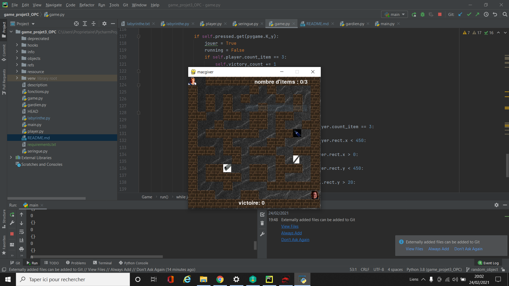

# game_projet3_OPC
LE JEU
MACGYVER est un jeu construit avec PYTHON.

Le but du jeu est de déplacer le personnage principal dans le labyrinthe afin de ramasser les objets. Une fois les objets ramassés, le personnage doit atteindre la position du gardien pour terminer la partie.

Les objets sont placés au hasard dans le labyrinthe.

Objectif principal:

Macgyver doit collecter tous les objets du labyrinthe et prendre la position du gardien pour remporter la victoire.

Si Macgyver ne récupère pas tous les objets avant d'atteindre la position du gardien, l'utilisateur perd la partie.

Installation
Installation et exécution dans un environnement virtuel:
Dans le cadre de l'installation du jeu, nous procédons à la mise en place via le Terminal d'un environnement virtuel, Virtualenv:

pip install virtualenv
Nous créons et activons virtualenv:

Création:
virtualenv -p python3 env
Activation:
source env/bin/activate
Dépendances
pip install -r requirements.txt
Enfin, nous lançons le jeu:
python3 game.py
Installation et exécution de packages
Afin de rendre le fichier exécutable, nous installons le module cx_Freeze:

python3 -m pip install cx_Freeze --upgrade
Ensuite, nous créons le fichier setup.py dans lequel nous rendons notre jeu exécutable.

Ensuite, nous générons un nom de dossier pour exécuter le jeu:

